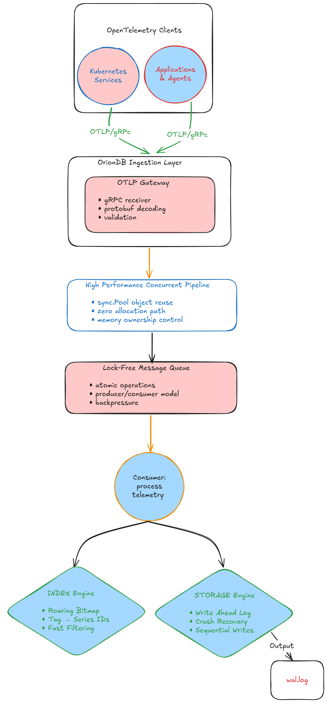

# 🌌 OrionDB

# Overview

**OrionDB** is a high-performance, experimental Go-based telemetry database capable of sustaining ten of thousands of requests per second while exploring the storage architectures that power modern observability platforms.

The project explores the engineering challenges behind large-scale observability systems, including:

- ingesting millions of telemetry events efficiently
- handling extreme metric cardinality
- minimizing garbage collection pressure
- building storage engines optimized for sequential writes
- designing low-latency indexing structures

**Rather than recreating an existing observability platform, OrionDB is designed as a systems engineering project to understand and implement the architectural principles behind modern telemetry infrastructure.**

---

# Why OrionDB?

Modern observability platforms face a fundamental scaling problem:

> **The number of telemetry dimensions grows exponentially faster than the number of machines producing them.**

In ephemeral environments such as Kubernetes and serverless platforms, a single metric can generate thousands of unique tag combinations throughout its lifetime.

```text
service=checkout-api
container_id=8f92ab31
pod_name=checkout-api-7d9f
git_hash=a91f3c
region=eu-west-3
customer_tier=enterprise
```

This high-cardinality explosion causes conventional telemetry pipelines to struggle. Generic time-series databases incur significant memory overhead from indexing raw strings, while naïve Go ingestion services suffer from excessive garbage collection when allocating millions of telemetry objects every second.

OrionDB investigates techniques used in production observability systems to address these bottlenecks.

| Architectural Challenge | System Impact | OrionDB Solution |
| ----------------------- | ------------- | ---------------- |
| **High-throughput ingestion** | CPU thrashing and GC pauses | Allocation-aware pipeline (`sync.Pool`) |
| **Millions of unique labels** | Massive index memory growth | Roaring Bitmap Inverted Index |
| **Cross-thread event passing** | Mutex contention | Lock-free atomic ring buffers |
| **Continuous writes** | Storage amplification | Custom LSM-Tree + Append-only WAL |

## Core Design Decisions

### Zero-Allocation OTLP Ingestion

OrionDB minimizes allocations on the network hot path through:

- reusable object pools (`sync.Pool`)
- zero-copy byte parsing
- lock-free MPMC ring buffers
- controlled object ownership

The objective is predictable latency while minimizing heap allocation pressure on the ingestion hot path via sync.Pool

### Lock-Free MPMC Ring Buffer

Metrics move from gRPC handlers to consumers through the bounded, lock-free MPMC queue. Each slot has a metric pointer and sequence number; producers and consumers claim slots with atomic compare-and-swap operations, then publish or release slots by updating the sequence.

### Roaring Bitmap Inverted Index

Rather than storing millions of tag strings directly, OrionDB converts labels into compressed bitmap indexes.

Queries such as:

```text
service=checkout
AND
region=eu-west
```

become fast bitmap intersections, enabling efficient filtering without scanning every metric.

### Custom LSM-Tree Storage

Instead of relying on generic storage libraries, OrionDB implements:

- append-only Write-Ahead Log (WAL)
- MemTables
- immutable SSTables
- streaming compaction

---

# Architecture



# Deployment & Operations Guide

For user and deployment documentation, see [docs](https://abderrahmenlamloumi.github.io/OrionDB/docs/getting-started).

---

# Storage Engine

The storage layer follows Log-Structured Merge Tree (LSM) principles.

```text
              Write Request
                    │
                    ▼
             Write-Ahead Log
                    │
                    ▼
                MemTable
                    │
             Flush Threshold
                    │
                    ▼
                 SSTables
                    │
                    ▼
               Compaction
```
---

# Storage Guarantees

OrionDB focuses on predictable write performance while maintaining durability.

## Crash Recovery

Incomplete WAL records are detected and safely truncated during startup.

## Sequential Writes

All writes are optimized around append-only disk access to minimize random I/O.

## Immutable SSTables

Immutable data files simplify compaction while reducing write amplification.

---

# Engineering Topics To Be Explored

Building OrionDB explores:

- Go runtime behavior
- memory ownership
- garbage collector optimization
- lock-free programming
- bitmap indexing
- storage engine internals
- telemetry architecture

---

# Status

I am building OrionDB as a systems engineering project. My focus is on understanding the architectural trade-offs behind modern observability 
platforms from first principles, rather than simply gluing together established tools.

# Roadmap
## Ingestion

- [ ] Custom OTLP/gRPC gateway: receives, validates, writes to WAL
- [ ] `sync.Pool` object reuse
- [ ] OpenTelemetry Collector integration
- [ ] Prometheus remote-write compatibility
- [ ] Native OTLP Support: Upgrade the ingestion endpoint to natively accept OpenTelemetry metric payloads

## Pipeline

- [x] Lock-free MPMC ring buffer
  - Reference I used to learn the basics: [A simple lock-free ring buffer](https://kmdreko.github.io/posts/20191003/a-simple-lock-free-ring-buffer/)
- [ ] Ingester → ring buffer → storage hot path fully connected

## Index

- [ ] Series registry, canonical keys, stable IDs
- [ ] Roaring bitmap inverted index
- [ ] Bitmap query optimizer

## Storage

- [ ] Append-only Write-Ahead Log with framed, CRC32-checked records
- [ ] WAL crash recovery
- [ ] MemTable (SkipList)
- [ ] SSTable format
- [ ] Bloom filters
- [ ] Compaction engine

## Processing & MLOps

- [ ] Consumer / stream processing 
- [ ] Anomaly detection

## Observability

- [ ] `pprof` profiling endpoints mounted

## Deployment

- [ ] Docker Compose: present, boots individual services
- [ ] Terraform / Helm: stubs only

## Validation & Benchmarks
- [ ] Load Testing Engine: to Built and validate under aggressive multi-worker chaos loads.
- [ ] Empirical Throughput: Proven to sustain **~38,000 to 40,000 req/sec** on a single node.
- [ ] Resilience & Backpressure: to validate active load-shedding (`ResourceExhausted`) ensuring zero OOM crashes under extreme concurrency spikes (e.g., 200+ workers).
---

## License

OrionDB is released under the [MIT License](./LICENSE).
